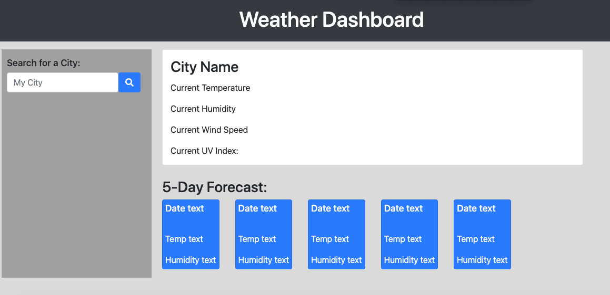
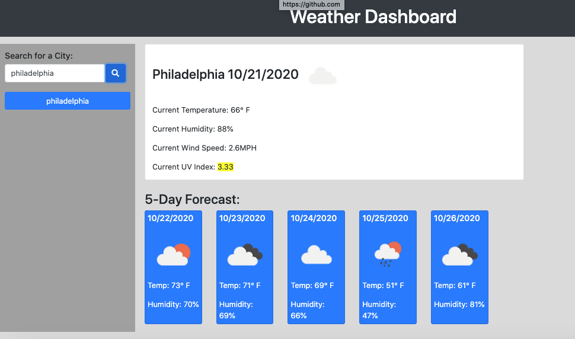
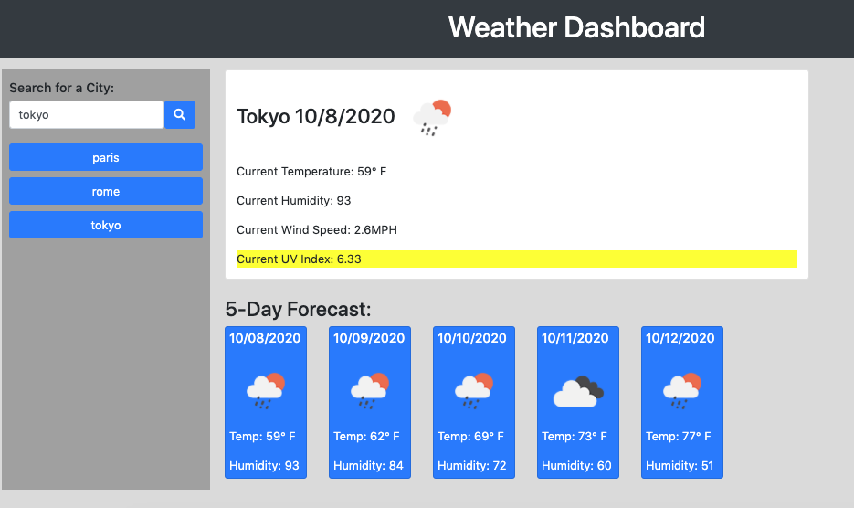

# weather-dashboard

## Live Link
[LINK TO DEPLOYED PAGE](https://theoriginalison.github.io/weather-dashboard/)

## Technology Used
HTML
Bootstrap & CSS
Local Storage
JavaScript
HTTP APIs
jQuery
Ajax

## Description
Utilizes the Open Weather API to return updated weather conditions for a searched city, as well as storing clickable saved searches. Five-day forecast is listed as well.

## Screenshots

## Features for Further Development
- Activity recommendations based on weather conditions
- Suggested outfits for weather conditions, or a "feels like" feature

## License

Copyright 2020 Alison Lubar

Permission is hereby granted, free of charge, to any person obtaining a copy of this software and associated documentation files (the "Software"), to deal in the Software without restriction, including without limitation the rights to use, copy, modify, merge, publish, distribute, sublicense, and/or sell copies of the Software, and to permit persons to whom the Software is furnished to do so, subject to the following conditions:

The above copyright notice and this permission notice shall be included in all copies or substantial portions of the Software.

THE SOFTWARE IS PROVIDED "AS IS", WITHOUT WARRANTY OF ANY KIND, EXPRESS OR IMPLIED, INCLUDING BUT NOT LIMITED TO THE WARRANTIES OF MERCHANTABILITY, FITNESS FOR A PARTICULAR PURPOSE AND NONINFRINGEMENT. IN NO EVENT SHALL THE AUTHORS OR COPYRIGHT HOLDERS BE LIABLE FOR ANY CLAIM, DAMAGES OR OTHER LIABILITY, WHETHER IN AN ACTION OF CONTRACT, TORT OR OTHERWISE, ARISING FROM, OUT OF OR IN CONNECTION WITH THE SOFTWARE OR THE USE OR OTHER DEALINGS IN THE SOFTWARE.

## Contact Information
Email: aslubar@gmail.com
